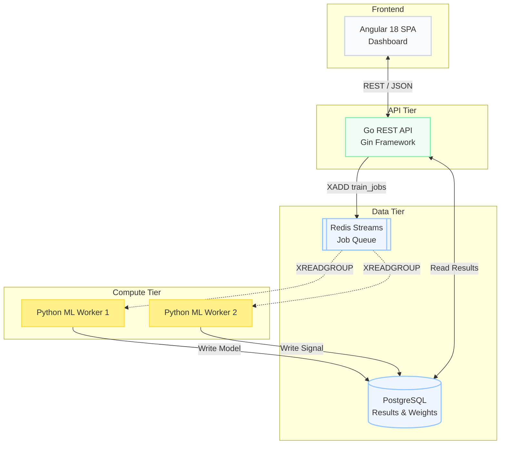
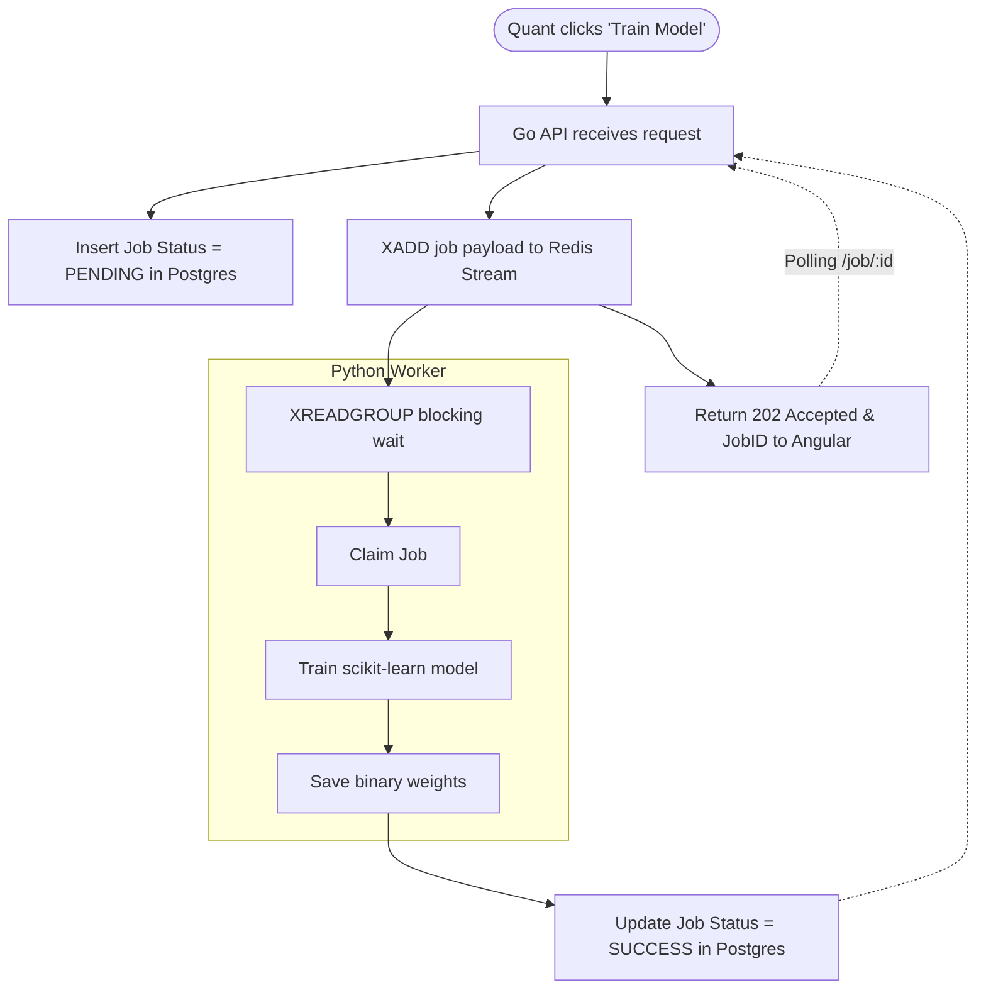

In a modern quantitative trading firm, research is not a solo endeavor. It is a highly specialized pipeline involving three distinct roles:

1. **The Data Scientist:** Cleans raw tick data and engineers features (like Order Book Imbalance).
2. **The Quant Researcher:** Takes those features, trains machine learning models, and backtests trading signals.
3. **The Portfolio Manager:** Monitors active strategies, allocates capital, and manages risk limits.

When building **QuantAlpha Lab**, an academic High-Frequency Trading (HFT) research platform, the architectural challenge was creating a system that supported all three workflows simultaneously. It required bridging the fast, concurrent world of Go backend engineering with the heavy, blocking world of Python machine learning.

## The Architecture (Bridging Go and Python)

We needed a frontend dashboard (Angular 18) for the Portfolio Manager to monitor live strategies, a fast API (Go) to handle concurrent web traffic, and a heavy compute layer (Python/scikit-learn) for the Quants.

We glued them together using **Redis Streams**.

### Why Redis Streams?

We could have exposed a Flask/FastAPI endpoint on the Python worker and had the Go API call it via HTTP. 

However, training a Random Forest on 30 minutes of tick data takes 10 to 45 seconds. An HTTP connection held open for 45 seconds wastes resources and is vulnerable to timeouts. 

Instead, we used Redis Streams to implement an asynchronous job queue with Consumer Groups. The Go API uses `XADD` to push a job payload (e.g., "Train model on VN30F2112 for 09:30-10:00"). The Python workers use `XREADGROUP` to reliably claim jobs. If a Python worker crashes mid-training, the job remains in the Pending Entries List (PEL) and is eventually reassigned.

## The Job Dispatch Flowchart

Here is how the system safely dispatches and tracks these heavy compute jobs.

## Designing for the Portfolio Manager

While the Python workers handle the heavy lifting, the Portfolio Manager needs real-time visibility into the system.

The Go API exposes a set of endpoints specifically for the PM dashboard:
- `GET /api/v1/jobs/active`: Which models are currently training?
- `GET /api/v1/strategies/:id/pnl`: What is the simulated profit/loss of strategy X?

Because the Go API directly queries PostgreSQL for these results, it can serve the PM dashboard instantly, completely decoupled from the CPU-heavy Python layer.

## Conclusion

QuantAlpha Lab demonstrates that you don't have to build monolithic systems in a single language. By using Redis Streams as an asynchronous boundary, we successfully combined Go's strengths (handling concurrent web requests and fast API routing) with Python's strengths (Pandas, scikit-learn, and data science tooling) into a cohesive, multi-role platform.
