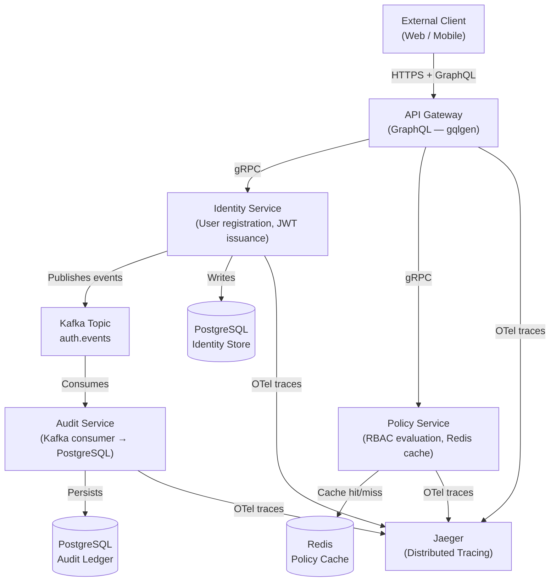

## Why gRPC for an Auth Platform?

When designing **Aegis**, the first question was: why gRPC over REST for internal service communication?

The answer is schema contracts. In a security-sensitive system, the worst possible outcome is two services silently disagreeing about the shape of an authorization request. With REST and JSON, a field rename or type change ships invisibly. With gRPC and Protocol Buffers, the compiler rejects it — the contract is enforced at build time.

Beyond contracts, gRPC gives us:
- **Multiplexed HTTP/2 streams** — multiple in-flight RPC calls on a single connection
- **Bidirectional streaming** — useful for token refresh event propagation
- **Built-in deadlines** — every call carries a timeout, preventing runaway goroutines
- **Interceptor chains** — a clean place to inject auth, tracing, and retry logic without polluting business code

---

## Architecture Overview

Aegis is composed of four services. Each owns a distinct domain responsibility with strict boundaries enforced by gRPC contracts:



> **Design principle:** The gateway is the only component that speaks to external clients. Internal services have no HTTP surface — only gRPC ports. This makes lateral movement from the external network impossible without going through the gateway's auth layer.

---

## Protocol Buffer Contracts

The schema is the single source of truth. All services generate their client stubs and server interfaces from these `.proto` files.

```protobuf
// proto/identity/v1/identity.proto
syntax = "proto3";
package identity.v1;

option go_package = "github.com/khoahotran/aegis/gen/identity/v1";

service IdentityService {
  // Register creates a new user account with Argon2id hashed credentials.
  rpc Register(RegisterRequest) returns (RegisterResponse);

  // Login validates credentials and returns a signed JWT pair.
  rpc Login(LoginRequest) returns (LoginResponse);

  // Refresh accepts a valid refresh token and issues a new access token.
  rpc Refresh(RefreshRequest) returns (RefreshResponse);
}

message RegisterRequest {
  string email    = 1;
  string password = 2;
  string username = 3;
}

message RegisterResponse {
  string user_id    = 1;
  string created_at = 2;
}

message LoginRequest {
  string email    = 1;
  string password = 2;
}

message LoginResponse {
  string access_token  = 1;
  string refresh_token = 2;
  int64  expires_at    = 3; // Unix timestamp
}

message RefreshRequest {
  string refresh_token = 1;
}

message RefreshResponse {
  string access_token = 1;
  int64  expires_at   = 2;
}
```

```protobuf
// proto/policy/v1/policy.proto
syntax = "proto3";
package policy.v1;

service PolicyService {
  // Evaluate checks if a subject is allowed to perform an action on a resource.
  rpc Evaluate(EvaluateRequest) returns (EvaluateResponse);
}

message EvaluateRequest {
  string subject_id   = 1;
  string resource_id  = 2;
  string resource_type = 3;
  string action       = 4;
}

message EvaluateResponse {
  bool   allowed  = 1;
  string rule_id  = 2; // Which rule granted or denied
  bool   cached   = 3; // True if served from Redis
}
```

---

## The Interceptor Chain

gRPC interceptors are middleware for RPC calls. We stack three interceptors on every service — handling authentication, tracing, and panic recovery — without touching business logic:

```go
package server

import (
    "context"

    "go.opentelemetry.io/contrib/instrumentation/google.golang.org/grpc/otelgrpc"
    "google.golang.org/grpc"
    "google.golang.org/grpc/codes"
    "google.golang.org/grpc/metadata"
    "google.golang.org/grpc/status"
)

// NewServer builds a gRPC server with the standard interceptor stack.
func NewServer(jwtSecret []byte) *grpc.Server {
    return grpc.NewServer(
        // 1. OpenTelemetry tracing — injects span context into every RPC
        grpc.StatsHandler(otelgrpc.NewServerHandler()),

        // 2. Chain of unary interceptors
        grpc.ChainUnaryInterceptor(
            recoveryInterceptor,   // catch panics; return Internal error
            authInterceptor(jwtSecret), // validate JWT on protected methods
        ),
    )
}

// authInterceptor validates the Bearer token present in gRPC metadata.
// It skips validation for explicitly whitelisted methods (login, register).
func authInterceptor(jwtSecret []byte) grpc.UnaryServerInterceptor {
    publicMethods := map[string]bool{
        "/identity.v1.IdentityService/Login":    true,
        "/identity.v1.IdentityService/Register": true,
    }

    return func(
        ctx context.Context,
        req interface{},
        info *grpc.UnaryServerInfo,
        handler grpc.UnaryHandler,
    ) (interface{}, error) {
        if publicMethods[info.FullMethod] {
            return handler(ctx, req)
        }

        md, ok := metadata.FromIncomingContext(ctx)
        if !ok {
            return nil, status.Error(codes.Unauthenticated, "missing metadata")
        }

        tokens := md.Get("authorization")
        if len(tokens) == 0 {
            return nil, status.Error(codes.Unauthenticated, "missing authorization header")
        }

        claims, err := validateJWT(tokens[0], jwtSecret)
        if err != nil {
            return nil, status.Error(codes.Unauthenticated, "invalid token")
        }

        // Inject validated claims into context for downstream handlers
        ctx = context.WithValue(ctx, contextKeyUserID, claims.Subject)
        return handler(ctx, req)
    }
}

// recoveryInterceptor converts panics into gRPC Internal errors,
// preventing the entire server from crashing on unexpected failures.
func recoveryInterceptor(
    ctx context.Context,
    req interface{},
    info *grpc.UnaryServerInfo,
    handler grpc.UnaryHandler,
) (resp interface{}, err error) {
    defer func() {
        if r := recover(); r != nil {
            err = status.Errorf(codes.Internal, "internal server error: %v", r)
        }
    }()
    return handler(ctx, req)
}
```

---

## OpenTelemetry Trace Propagation

Every service initializes the OTel SDK at startup and exports traces to Jaeger. Trace context is automatically propagated across gRPC calls via the `otelgrpc` handler — no manual span passing required:

```go
package telemetry

import (
    "context"

    "go.opentelemetry.io/otel"
    "go.opentelemetry.io/otel/exporters/otlp/otlptrace/otlptracegrpc"
    "go.opentelemetry.io/otel/sdk/resource"
    sdktrace "go.opentelemetry.io/otel/sdk/trace"
    semconv "go.opentelemetry.io/otel/semconv/v1.21.0"
)

// InitTracer bootstraps the OpenTelemetry tracer provider.
// The returned shutdown function must be called on process exit.
func InitTracer(ctx context.Context, serviceName string) (func(), error) {
    exporter, err := otlptracegrpc.New(ctx,
        otlptracegrpc.WithEndpoint("jaeger:4317"),
        otlptracegrpc.WithInsecure(),
    )
    if err != nil {
        return nil, err
    }

    res, err := resource.New(ctx,
        resource.WithAttributes(
            semconv.ServiceName(serviceName),
            semconv.ServiceVersion("1.0.0"),
        ),
    )
    if err != nil {
        return nil, err
    }

    tp := sdktrace.NewTracerProvider(
        sdktrace.WithBatcher(exporter),
        sdktrace.WithResource(res),
        sdktrace.WithSampler(sdktrace.AlwaysSample()),
    )

    otel.SetTracerProvider(tp)

    return func() {
        _ = tp.Shutdown(context.Background())
    }, nil
}
```

With this setup, a single `Login` mutation at the GraphQL gateway produces a distributed trace that spans:

```
GraphQL Gateway (Resolve Login mutation)
  └── gRPC IdentityService.Login
        └── PostgreSQL query (fetch user by email)
        └── Argon2id verify (CPU-bound)
        └── JWT sign
  └── Kafka publish (auth.login.succeeded event)
        └── AuditService consume (write to audit_log table)
```

This makes tracing authentication failures down to exact database query latency or Argon2id verification time trivial.

---

## Kafka Audit Log: At-Least-Once Delivery

Every authentication event (login, failed attempt, token refresh, permission denial) is published to a Kafka topic and consumed by the Audit Service. Because Kafka guarantees at-least-once delivery, the consumer should be idempotent to avoid duplicate audit rows on redelivery. The snippet below illustrates a standard way to do that with an `EventID`-keyed upsert — it is a reference pattern, not a description of the consumer currently committed to the Aegis repository (see the note after the code):

```go
package audit

import (
    "context"
    "encoding/json"

    "github.com/segmentio/kafka-go"
    "go.uber.org/zap"
)

type AuditEvent struct {
    EventID   string `json:"eventId"`   // Used as idempotency key
    UserID    string `json:"userId"`
    EventType string `json:"eventType"` // e.g. "auth.login.succeeded"
    IP        string `json:"ip"`
    Timestamp int64  `json:"timestamp"`
}

type Consumer struct {
    reader *kafka.Reader
    db     AuditRepository
    logger *zap.Logger
}

func (c *Consumer) Run(ctx context.Context) {
    for {
        msg, err := c.reader.ReadMessage(ctx)
        if err != nil {
            if ctx.Err() != nil {
                return // Context cancelled — clean shutdown
            }
            c.logger.Error("kafka read error", zap.Error(err))
            continue
        }

        var event AuditEvent
        if err := json.Unmarshal(msg.Value, &event); err != nil {
            c.logger.Error("failed to decode audit event", zap.Error(err))
            continue
        }

        // This pattern uses INSERT ... ON CONFLICT DO NOTHING
        // so redelivered events are silently ignored.
        if err := c.db.InsertIfNotExists(ctx, event); err != nil {
            c.logger.Error("failed to persist audit event",
                zap.String("eventId", event.EventID),
                zap.Error(err),
            )
        }
    }
}
```

> **Current implementation vs. this snippet:** the Aegis repository's actual consumer, `consumer.go` in the audit service, does not yet implement this deduplication step — it performs a plain insert with no conflict handling, and the `AuditLog` table has no `EventID` or other field to key a conflict on. The pattern above is the standard, recommended way to close that gap; it is not a description of the code currently committed.

---

## Token Bucket Rate Limiting

The gateway enforces per-user rate limiting using Redis. The snippet below illustrates a token-bucket pattern implemented as an atomic Lua script — each user gets 100 tokens refilled per minute, and the script-level atomicity prevents race conditions under concurrent load. This is a reference pattern, not a description of the limiter currently committed to the Aegis repository (see the note after the code):

```go
package ratelimit

import (
    "context"
    "fmt"
    "time"

    "github.com/redis/go-redis/v9"
)

const (
    bucketSize     = 100
    refillRate     = 100 // tokens per minute
    refillInterval = time.Minute
)

type Limiter struct {
    rdb *redis.Client
}

// Allow returns true if the subject has remaining tokens.
// It uses a Lua script for atomic read-modify-write.
func (l *Limiter) Allow(ctx context.Context, subjectID string) (bool, error) {
    key := fmt.Sprintf("ratelimit:%s", subjectID)
    now := time.Now().UnixMilli()

    // Lua script: refill tokens based on elapsed time, then consume one
    script := redis.NewScript(`
        local key = KEYS[1]
        local now = tonumber(ARGV[1])
        local bucket_size = tonumber(ARGV[2])
        local refill_rate = tonumber(ARGV[3])
        local refill_interval_ms = tonumber(ARGV[4])

        local data = redis.call("HMGET", key, "tokens", "last_refill")
        local tokens = tonumber(data[1]) or bucket_size
        local last_refill = tonumber(data[2]) or now

        local elapsed = now - last_refill
        local refilled = math.floor(elapsed / refill_interval_ms) * refill_rate
        tokens = math.min(bucket_size, tokens + refilled)

        if tokens < 1 then
            return 0
        end

        tokens = tokens - 1
        redis.call("HMSET", key, "tokens", tokens, "last_refill", now)
        redis.call("EXPIRE", key, 300)
        return 1
    `)

    result, err := script.Run(ctx, l.rdb, []string{key},
        now, bucketSize, refillRate, refillInterval.Milliseconds(),
    ).Int()
    if err != nil {
        return false, err
    }

    return result == 1, nil
}
```

> **Current implementation vs. this snippet:** the Aegis repository's actual rate limiter, `ratelimit.go` in the shared rate-limit package, is not a token bucket — it's a simpler Redis `INCR`/`EXPIRE` fixed-window counter (100 requests/minute per IP, 1000/minute per user). Both approaches stop the same class of credential-stuffing abuse; the trade-off is precision, not correctness — a fixed window can allow a short burst right at the window boundary that a token bucket smooths out. The Lua-scripted token bucket above is the more precise pattern, not the code currently running.

---

## Performance Characteristics

These figures describe the architecture's intended latency budget — design targets and expected ranges derived from the components involved (a Redis lookup, an intentionally-tuned Argon2id cost parameter, a Kafka consumer's poll cadence), not the output of a controlled load test. No load-testing tool, request volume, hardware environment, or percentile breakdown is claimed for these numbers.

| Component | Metric | Value |
|:---|:---|:---|
| **Policy evaluation (cache hit)** | Latency | < 5ms (Redis) |
| **Policy evaluation (cache miss)** | Latency | ~15ms (DB query + cache write) |
| **Login RPC (Argon2id verify)** | Latency | ~80–120ms (intentionally slow) |
| **JWT validation (interceptor)** | Overhead | < 1ms per call |
| **Audit event lag** | Kafka consumer | < 200ms end-to-end |

> Argon2id is deliberately slow — that is the point. Slower verification directly raises the cost of an offline brute-force attack, since an attacker's guess rate is bounded by how fast they can compute the hash — and Argon2id's memory-hardness resists GPU/ASIC acceleration in a way a simple iteration-count increase does not. The exact cost advantage over any specific bcrypt configuration depends on the work factors chosen for each, so no fixed multiplier is claimed here; the goal is a verification cost that stays imperceptible to a real login while meaningfully taxing an attacker.

<a href="/labs/go-vs-ts-concurrency" class="lab-cta">
  View the Interactive Go vs TS Concurrency Benchmark
  <svg xmlns="http://www.w3.org/2000/svg" width="16" height="16" viewBox="0 0 24 24" fill="none" stroke="currentColor" stroke-width="2" stroke-linecap="round" stroke-linejoin="round"><path d="m9 18 6-6-6-6"/></svg>
</a>

---

## Key Takeaways

1. **Protobuf contracts catch breaking changes at compile time.** This is the single most valuable property of gRPC for a security-sensitive microservice — silent schema drift cannot happen.
2. **Stack interceptors, not business logic.** Auth, tracing, rate limiting, and recovery belong in the interceptor chain, not inside handler functions. Handlers should only execute domain logic.
3. **Propagate trace context through every hop.** With OTel + `otelgrpc`, a single trace ID follows a request from GraphQL resolver through three gRPC services to the Kafka consumer — making latency investigations trivial.
4. **Design rate limiting with Redis Lua scripts.** Atomic read-modify-write operations on token buckets must be script-level atomic to prevent race conditions under concurrent load.
