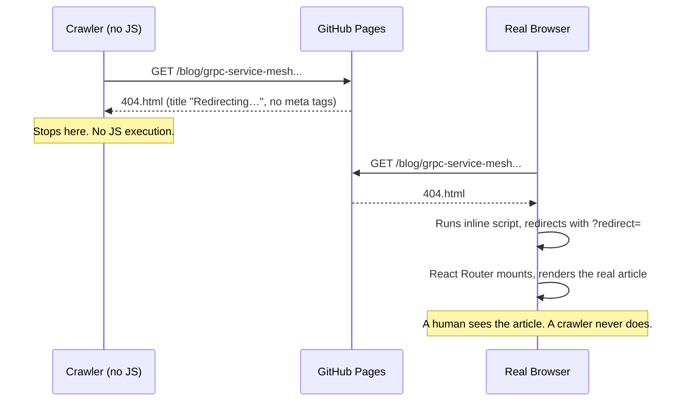

I built this portfolio to be read. So it's a little embarrassing that for most of its life, almost nothing on it was actually *findable* — not by a search engine, not by a shared link on LinkedIn, not by anything that doesn't execute JavaScript. I found this by accident, doing an unrelated audit, and the fix turned into the single highest-leverage change I've made to this codebase.

## The command that started it

I was verifying something else entirely — whether an OG image URL was correct — when I ran this:

```bash
$ curl -sI https://khoahotran.github.io/portfolio/blog/grpc-service-mesh-in-go-aegis-architecture
HTTP/2 404
```

That's not a typo in the URL. That's a real article, linked from the homepage, indexed in `sitemap.xml`, with its own generated Open Graph image. And it returns a 404 to any client that doesn't run JavaScript.

```bash
$ curl -s https://khoahotran.github.io/portfolio/blog/grpc-service-mesh-in-go-aegis-architecture | grep '<title>'
<title>Redirecting…</title>
```

I checked the sitemap systematically after that. **51 of 52 URLs** answered 404. Only the homepage, `/`, worked from a cold request.

## Why: a single-page app has exactly one page

This site is a client-rendered SPA — React Router, `import.meta.glob` pulling in Markdown at runtime, no server. GitHub Pages has no rewrite rules, so the standard workaround (and the one I'd shipped) is the [`rafgraph/spa-github-pages`](https://github.com/rafgraph/spa-github-pages) pattern: a `404.html` that GitHub Pages serves for any unrecognized path, which re-encodes the requested path as a query string and redirects to the root; an inline script in `index.html` then decodes it and calls `history.replaceState` before React Router mounts.



The pattern works exactly as advertised — for a browser. That was always the audience I was testing against: I'd open a deep link, watch it resolve, and move on. I never once ran `curl` against my own site, because why would you check the API when the UI plainly works?

The gap is that a crawler is not a browser with JavaScript disabled by choice — it's a client that was never going to execute a script in the first place. Social platforms (LinkedIn, Slack, Twitter) fetch a URL once, read whatever HTML comes back, and don't retry after a redirect chain resolves in a browser they don't have. Google's crawler *can* render JavaScript, on a delayed second pass, but a 404 status code on the first fetch is often enough to deprioritize or drop the URL before that second pass happens at all.

So the practical effect, for months: 33 Open Graph images I'd generated at build time — one per article, with the title and summary rendered onto a 1200×630 canvas — were never seen by anything that could show them. Sharing an article anywhere produced a blank, title-less card. The site was effectively one indexable page pretending to be thirty-four.

## What I built instead

The honest first instinct is "migrate to Next.js" — get SSR for free, problem solved. I didn't do that, and the reasoning is its own article ([Why Prerender Instead of Migrating to Next.js](/research/why-prerender-instead-of-migrating-to-next-js)). The short version: this site has a working, well-tested custom content engine, and the actual problem wasn't the framework — it was that nothing generated real HTML at build time. So I built exactly that.

`scripts/prerender.mjs` runs after `vite build`: it starts a small static server over `dist/`, opens every route in headless Chromium, waits for the article to actually render — not just for the network to go idle, but for `.mermaid-diagram` nodes to reach `.mermaid-rendered` and for the loading spinner to be gone — and serializes `document.documentElement.outerHTML` to `dist/<route>.html`.

A few details mattered more than I expected going in:

- **GitHub Pages resolves an extensionless path to its sibling `.html` file with a 200 and no redirect.** I verified this before committing to the output shape (`curl -sI .../portfolio/404` → `200`), because if it weren't true, every canonical URL and sitemap entry would need a trailing-slash migration.
- **Absolute URLs baked into a snapshot are worse than the 404s they replace.** `useSeo` builds `canonical`, `og:url`, and `og:image` from `window.location.origin` at runtime — which, during prerendering, is a local server on `127.0.0.1:<port>`. The script rewrites that origin to the real one before writing anything to disk, and hard-fails the build if any `127.0.0.1` string survives the rewrite. A canonical tag pointing at localhost would have been a worse failure mode than the one I was fixing, and a quieter one — it wouldn't 404, it would just be wrong.
- **A route that prerenders without its own metadata is a silent regression, not a success.** The script asserts every page has a real `<title>` (not the shell default), a matching `rel="canonical"`, an `og:image`, and no leftover Mermaid error box — and fails the whole build if any of that is missing. This mirrors a rule the build already enforced for content: `related:` frontmatter referencing a nonexistent article fails the build instead of silently rendering nothing. Metadata deserves the same treatment.

```bash
$ npm run build
...
[prerender] PASS — 54 pages + 6 redirects, 2.08 MB total
```

And the same `curl` that started this, run again:

```bash
$ curl -sI https://khoahotran.github.io/portfolio/blog/grpc-service-mesh-in-go-aegis-architecture
HTTP/2 200
$ curl -sA 'facebookexternalhit/1.1' .../blog/grpc-service-mesh-in-go-aegis-architecture | grep -E 'title|og:image'
<title>gRPC Service Mesh in Go: Designing the Aegis Auth Platform | Khoa Tran Engineering Portfolio</title>
<meta property="og:image" content="https://khoahotran.github.io/portfolio/og/grpc-service-mesh-in-go-aegis-architecture.png" />
```

> [!NOTE]
> Test your site the way its least forgiving client sees it, not the way you see it. A browser and a
> crawler share a URL and nothing else — one runs your JavaScript and forgives a redirect chain, the
> other reads one HTTP response and moves on. I'd tested this site by clicking links in a browser for
> months. The bug was invisible from there by construction.

## What this didn't fix

Prerendering closes the distribution gap — every route now ships real, crawlable HTML. It does not shrink the client bundle: after first paint, the app still boots as a normal SPA and the ~159 KB gzip Markdown-rendering chunk still ships for every article, because `MarkdownContent`'s copy buttons, figure captions, and status-mark rendering all run client-side after mount. That's a separate, larger question — serving precompiled article HTML as data instead of recompiling it in the browser — and it's still open, tracked honestly as unstarted rather than folded into this fix to make the change sound more complete than it is.
