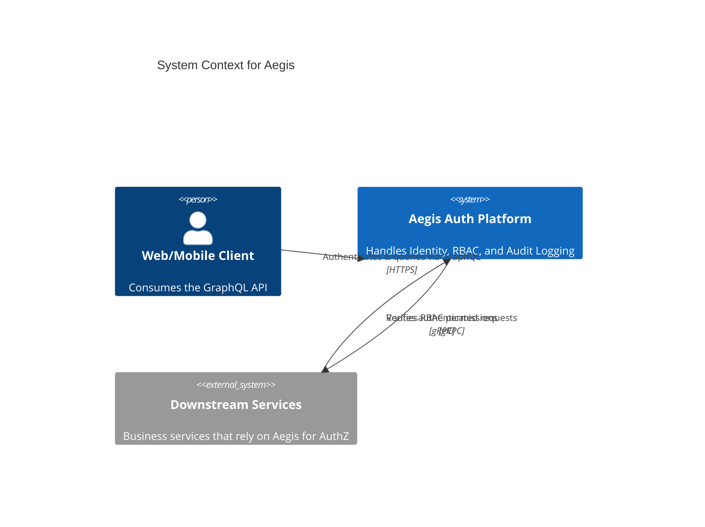
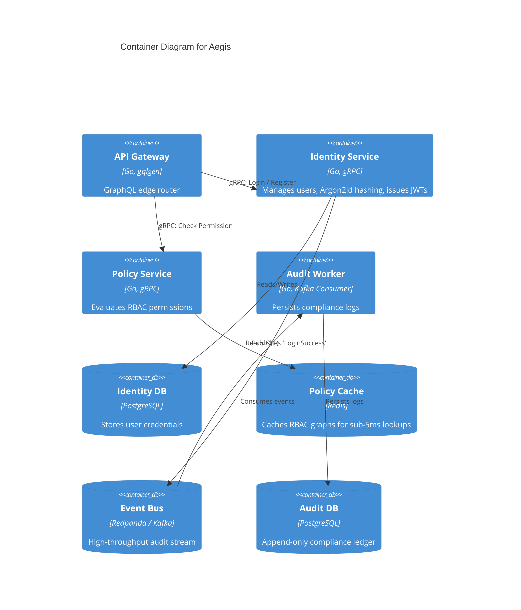

## Provenance & Source

- **Provenance** — Self-directed engineering project. Designed and built solo to production standards;
  it runs in Docker Compose, not in front of real users. Where the shipped code is narrower than the
  design, this write-up says so explicitly rather than describing the intent as the outcome.
- **Role** — Sole author: architecture, all four Go services, and the local infrastructure.
- **Source** — [github.com/khoahotran/aegis](https://github.com/khoahotran/aegis)

## Project Foundation

**Business Problem:** Monolithic authorization logic becomes a bottleneck as an organization scales. When multiple teams build distinct microservices, forcing them to reimplement JWT validation and Role-Based Access Control (RBAC) leads to security inconsistencies and duplicated effort.

**Goals:**
1. Centralize Identity (Authentication) and Policy (Authorization).
2. Achieve **sub-5ms** authorization checks so downstream services aren't penalized.
3. Provide a unified GraphQL API gateway for clients, while keeping internal service-to-service communication on high-speed gRPC.
4. Build a durable audit log — every auth event delivered at-least-once and safely deduplicated, rather than best-effort — as a foundation for compliance.

## Architecture

Aegis is built using a Hexagonal Architecture (Ports and Adapters) pattern within each microservice to decouple domain logic from infrastructure.

### C4 Context Diagram

### C4 Container Diagram

## Engineering Decisions

### 1. gRPC vs REST for Internal Traffic
**Decision:** All internal microservice communication runs on gRPC.
**Trade-offs:** 
- *Pros:* Protobuf serialization is drastically faster and more compact than JSON. Strongly typed contracts prevent runtime parsing errors. HTTP/2 multiplexing reduces connection overhead.
- *Cons:* Harder to debug with `curl`.
- *Mitigation:* We use `grpcurl` and expose a GraphQL Gateway to the frontend, so web clients never have to speak gRPC directly. See the [ADR: Why GraphQL Gateway over REST](/research/adr-graphql-gateway-over-rest) for the full trade-off analysis behind that gateway choice.

  <a href="/labs/go-vs-ts-concurrency" class="lab-cta-inverse">
    Benchmark: Go vs TypeScript Concurrency
    <svg xmlns="http://www.w3.org/2000/svg" width="16" height="16" viewBox="0 0 24 24" fill="none" stroke="currentColor" stroke-width="2" stroke-linecap="round" stroke-linejoin="round"><path d="m9 18 6-6-6-6"/></svg>
  </a>

### 2. Lock-Free RBAC Cache
**Decision:** The Policy Service evaluates permissions using a Redis-backed cache instead of querying PostgreSQL on every request.
**Implementation:** Permissions are flattened into a graph and cached as Redis Sets. An authorization check is a single `SISMEMBER user:123:permissions read_orders` command, taking < 1ms.

### 3. Asynchronous Audit Logging
**Decision:** Writing to an audit log synchronously during a login request adds latency and ties availability to the audit database.
**Implementation:** We implemented an Event-Driven architecture using Redpanda (Kafka). The Identity service publishes an `AuthEvent` and returns immediately. A separate Audit Worker consumes the topic and batch-inserts into PostgreSQL.

## Production Engineering

- **Rate Limiting:** The Gateway rate-limits requests via Redis to blunt brute-force and credential-stuffing attempts. The current repository implements this as a fixed-window `INCR`/`EXPIRE` counter (separate IP and per-user limits); a Lua-scripted token-bucket variant — shown as the more precise reference pattern in the [gRPC service mesh walkthrough](/blog/grpc-service-mesh-in-go-aegis-architecture) — is not what's currently running.
- **Distributed Tracing:** OpenTelemetry is instrumented across all gRPC calls. Every request has a `trace_id` injected into the context, allowing us to visualize the exact latency breakdown between the Gateway, Identity Service, and Database in Jaeger.
- **Graceful Shutdown:** The Audit worker traps `SIGTERM`, stops pulling new work, and lets in-flight processing finish before exiting — this is one piece of a zero-downtime Kubernetes rollout design, though it is not the whole story (readiness probes, PodDisruptionBudgets, and drain-timeout tuning also matter and aren't demonstrated here). The Gateway, Identity, and Policy services do not yet implement the same signal handling in the current repository.

## Reflection

**Lessons Learned:**
- **Caching is hard:** Flattening the RBAC graph into Redis was highly performant for reads, but making sure the cache invalidates correctly when a user's role is changed required complex distributed locking mechanisms.
- **Tracing is non-negotiable:** Without OpenTelemetry, debugging latency spikes across 3 microservices would have been impossible. It must be implemented from day one, not as an afterthought.

**Future Evolution:**
I plan to migrate the API Gateway from a custom Go GraphQL server to an Apollo Federation setup to allow downstream services to seamlessly extend the GraphQL schema.

<a href="/graph" class="inline-block mt-8 text-sm text-slate-500 hover:text-slate-700 hover:underline transition-colors">See how this project connects to the rest of the ecosystem &rarr;</a>
