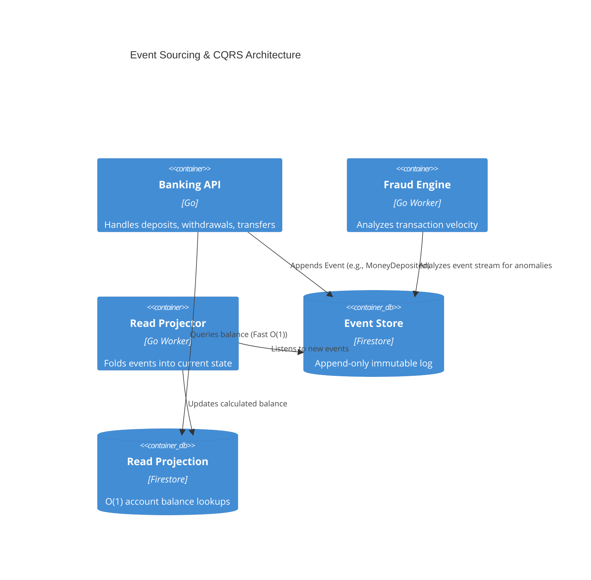
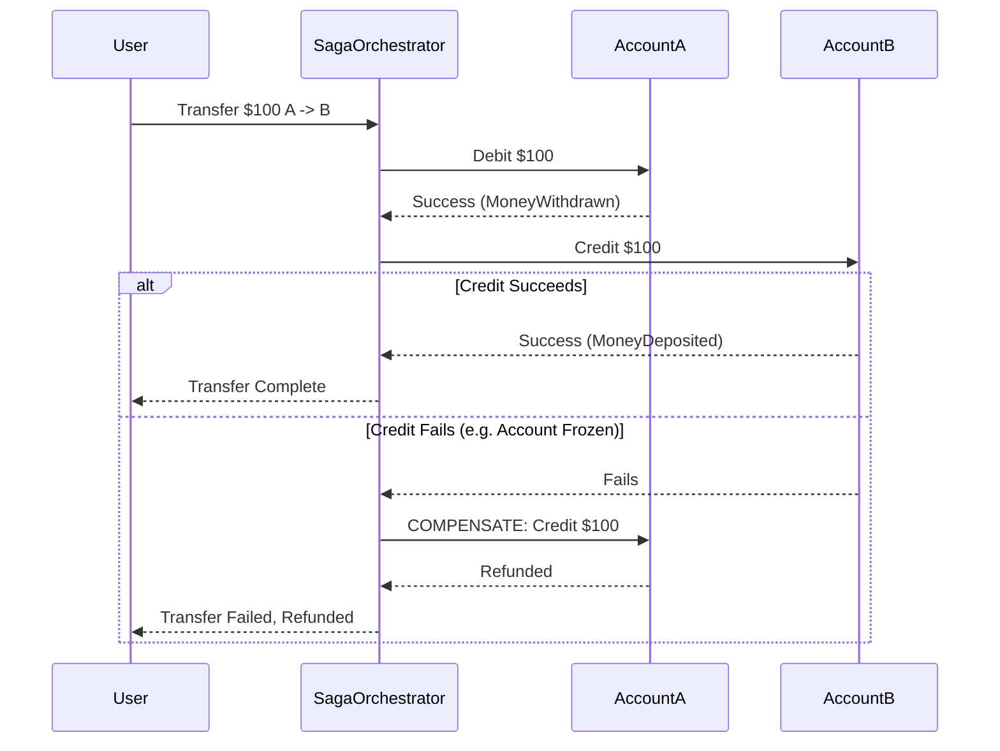

## Project Foundation

**Business Problem:** Traditional banking ledgers use mutable database rows (e.g., `UPDATE accounts SET balance = balance - 100`). If a bug occurs, or an auditor asks *why* an account has a specific balance, the history is lost unless you explicitly maintain complex audit tables. Furthermore, executing cross-account transfers across different banking microservices requires distributed transactions, which can lock up databases and cause cascading failures.

**Goals:**
1. Design for full auditability of all financial movements — every state change derived from an immutable, replayable event log.
2. Implement O(1) read latency for account balances.
3. Handle cross-account transfers safely without relying on 2-Phase Commit (2PC).
4. Implement real-time fraud detection without slowing down the core ledger.

## Architecture

This project strictly separates writes from reads using **CQRS** (Command Query Responsibility Segregation) and derives all state using **Event Sourcing**.

### CQRS & Event Sourcing Flow

  <a href="/labs/event-sourcing-replay" class="inline-flex items-center gap-2 rounded-lg bg-slate-900 px-6 py-3 text-sm font-semibold text-white shadow-sm hover:bg-slate-800 transition-all">
    Try the Interactive Event Sourcing Replay Lab
    <svg xmlns="http://www.w3.org/2000/svg" width="16" height="16" viewBox="0 0 24 24" fill="none" stroke="currentColor" stroke-width="2" stroke-linecap="round" stroke-linejoin="round"><path d="m9 18 6-6-6-6"/></svg>
  </a>

### Saga Pattern for Distributed Transfers

Transferring money between Account A and Account B requires altering two distinct aggregates. The target design is an orchestration-based Saga — see the [Saga pattern deep dive](/system-design/implementing-the-saga-pattern-for-distributed-transfers) for how that design compares to the simpler, choreography-style Saga manager currently committed to the repository.

  <a href="/labs/saga-state-machine" class="inline-flex items-center gap-2 rounded-lg bg-slate-900 px-6 py-3 text-sm font-semibold text-white shadow-sm hover:bg-slate-800 transition-all">
    Try the Interactive Saga Lab
    <svg xmlns="http://www.w3.org/2000/svg" width="16" height="16" viewBox="0 0 24 24" fill="none" stroke="currentColor" stroke-width="2" stroke-linecap="round" stroke-linejoin="round"><path d="m9 18 6-6-6-6"/></svg>
  </a>

## Engineering Decisions

### 1. Optimistic Concurrency Control (OCC)
**Decision:** How do we prevent a double-spend if two withdrawals hit the Event Store at the exact same millisecond?
**Implementation:** Every aggregate has a `Version`. When appending an event, the code includes the expected version. `AppendEvent(aggregateID, expectedVersion=5)`. If another process already wrote version 5, Firestore rejects the transaction. The API then retries, recalculates the balance, and potentially rejects the withdrawal if funds are now insufficient.

### 2. Snapshotting
**Decision:** Replaying 100,000 events to calculate a user's balance takes too long.
**Implementation:** Every 100 events, a background worker computes the current state and saves a `Snapshot`. Future replays only need to load the latest snapshot and replay the events that occurred *after* it.

## Production Engineering

- **Real-Time Fraud Detection:** A detached worker listens to the Event Store stream. It applies velocity rules (e.g., "more than 3 transfers in 1 minute") and burst-silence rules. Because it listens asynchronously, heavy ML/rules engines never block the user's API request. If fraud is detected, it simply appends an `AccountFrozen` event.
- **Metrics:** Instrumented with Prometheus, tracking business flows and operational counters — for example, money deposited/withdrawn (`banking_money_in_total`, `banking_money_out_total`) and fraud incidents (`banking_fraud_detected_total`). No dedicated Saga-compensation metric or alerting rule is currently implemented.

## Reflection

**Lessons Learned:**
- **Event Versioning:** You must think carefully about event schema evolution. An event is immutable; you cannot change it once it's written. We had to implement an `Upcaster` pattern to transform V1 events into V2 shapes during replay.
- **Eventual Consistency:** The UI must be designed to handle eventual consistency. When a user deposits money, the API returns `202 Accepted`, and the Read Projector asynchronously folds the new event into the read model before a balance query reflects it. The exact lag is implementation- and environment-dependent — no load test or SLO is measured for it here — so the UI copes by polling or subscribing rather than assuming immediate consistency. The Fraud Engine consumes the raw event stream directly rather than the projected read model (see the architecture diagram above), so fraud detection itself is not delayed by projection lag; a balance read made in that same window, however, can briefly reflect stale state.

<a href="/graph" class="inline-block mt-8 text-sm text-slate-500 hover:text-slate-700 hover:underline transition-colors">See how this project connects to the rest of the ecosystem &rarr;</a>
