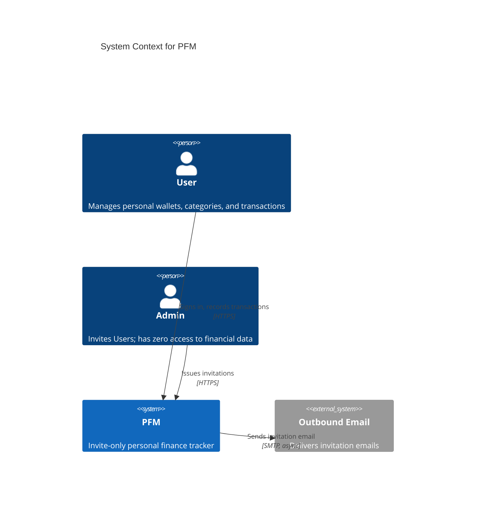
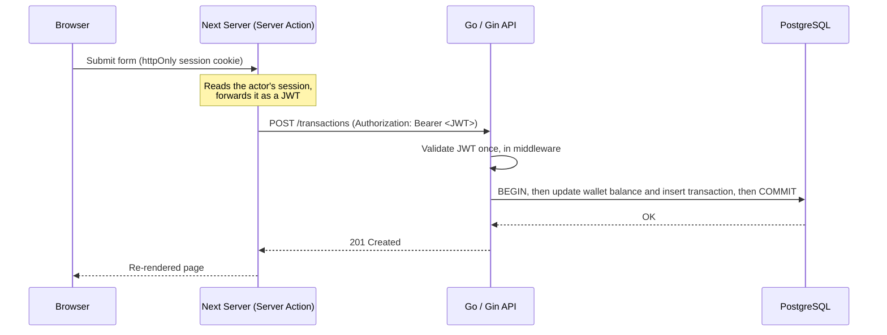
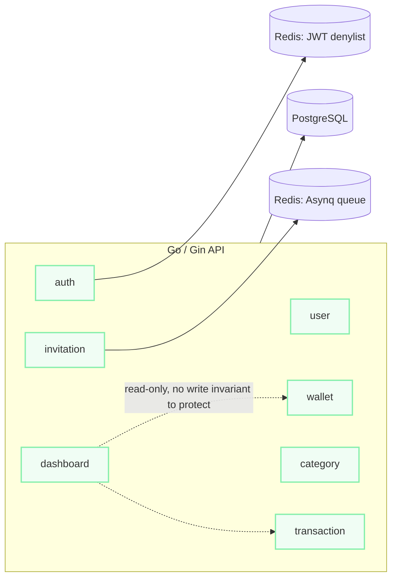

## Provenance & Source

- **Provenance** — Self-directed engineering project, built solo to production standards. It is not
  deployed for real users and holds no real money.
- **What makes this one different from the other two flagships** — Aegis and Core Banking are both
  code-first: the architecture lives in the repository and the write-up reconstructs it. PFM is
  spec-first. Every business rule below traces to a numbered requirement in an SRS, a design
  decision in an SDS, and a constitution of non-negotiable engineering rules — all three documents
  version-controlled alongside the code and kept in lockstep with it as a matter of policy, not
  convention.
- **Source** — `github.com/khoahotran/PFM` (repository is being made public; if this link 404s,
  the write-up below still reflects the real, working system).

## Project Foundation

**Business problem:** Personal finance apps default to open registration, which means the schema
has to defend itself against arbitrary sign-ups from day one — spam accounts, unverifiable emails,
no real notion of who is allowed in. PFM sidesteps that by construction: there is no self-registration
endpoint at all. Every account originates from an email Invitation issued by a pre-seeded Admin, with
a strict, unextendable expiry. The access-control problem is solved by not having one.

**Goals:**
1. A hard boundary between the browser and the financial API — no client-side code ever holds a
   credential the Go backend will accept.
2. Financial correctness under concurrency: a Wallet balance and its Transaction history update
   atomically, and a currency, once transacted in, is locked.
3. Prove the pattern works before scaling it: one bounded context (`auth`) shipped first, and every
   later feature had to prove it didn't cross that context's boundary before being merged.

## Architecture

### System Context

### The Boundary: Server Actions as the Only Client

The browser never calls the Go API directly. Every mutation is a Server Action running on the Next
server, which reads the actor's `httpOnly` session cookie and forwards it to Go as a bearer JWT. The
practical effect: there is no API base URL, no token, and no credential anywhere in code that ships
to the browser. Classic CSRF doesn't apply to the Next→Go hop either — it's server-to-server on a
private Docker network, not a browser-originated request the API has to distrust.

> [!NOTE]
> The frontend runs on **vinext** — a tool that reimplements the Next.js 16 App Router / Server
> Actions surface on top of Vite instead of Next's own bundler. That's a real, named risk: vinext is
> experimental tooling, flagged in the project's own constitution as a Software Supply Chain
> concern. The mitigation isn't "it won't happen" — it's that vinext targets API compatibility with
> Next.js, so falling back to Next's native toolchain wouldn't require rewriting the app. Naming a
> risk you can't eliminate, and shipping the boundary that limits its blast radius, is more honest
> than pretending the dependency is safe.

### Backend: One Bounded Context per Module

Each module — `auth`, `invitation`, `user`, `wallet`, `category`, `transaction`, `dashboard` — is a
full vertical slice: `handler` → `service` → `dto` → `repository`, the last generated by `sqlc` and
never hand-edited. The rule that makes this a real boundary rather than a folder convention: **a
module may not import another module's internals.** Cross-context calls go through the other
module's exported service or handler types only. `dashboard` is the one documented exception — it
reads `wallets` and `transactions` directly via its own read-only queries rather than routing
through those modules' services, because a read has no write invariant to protect. Everywhere else,
a duplicated DTO shape across two modules is the accepted cost of not coupling them together.

The backend didn't start this way. It was originally organized by technical layer (all handlers
together, all services together) and was explicitly re-architected to package-by-feature partway
through, once it became clear that a layer-first layout made it easy to reach across a domain
boundary by accident and hard to ever pull one context out into its own service later. The rewrite
is dated and reasoned about in the SDS changelog rather than left as an unexplained restructure.

## Engineering Decisions

### 1. Redis, for Two Things, Not One

Redis holds no domain data — Postgres is the sole authoritative store, including invitation
expiry. Redis backs exactly two things: the **Asynq** task queue (invitation emails dispatch
asynchronously so an Admin issuing an invite doesn't block on SMTP) and a **JWT logout denylist**
(logout writes the token's `jti` to Redis with a TTL equal to the token's remaining life; auth
middleware rejects a denylisted `jti` even when the signature is still valid). The two uses
reinforced each other as one decision — once Redis was needed for the denylist, Asynq's Redis-backed
queue was the lower-cost choice over introducing a second broker.

**Trade-off, named rather than hidden:** permissions are baked into the JWT at login and not
re-checked per request. A permission change or a user deactivation doesn't retroactively revoke an
already-issued token — it just expires on its own 15-minute TTL, or via explicit logout. That's a
real staleness window, and the design doc says so instead of implying the token is always live.

### 2. Stateless JWT Over Server-Side Sessions

Chosen so the API can scale horizontally without sticky sessions or a shared session store — "at
the cost of needing the Redis logout denylist" is the design doc's own phrasing, not an
after-the-fact justification. That denylist is the whole reason logout is not simply "delete a
cookie": a bearer token is valid until it's on the list or it expires, whichever comes first.

### 3. Financial Correctness Under Concurrency

A Wallet balance update and its Transaction record are written inside the same database
transaction, with a `SELECT ... FOR UPDATE` row lock on the wallet to serialize concurrent writers.
A wallet's currency locks the first time it has a transaction — not because currency conversion is
technically hard, but because re-interpreting a historical amount under a different currency later
would silently rewrite the past. Money is serialized as `NUMERIC(19,4)` end to end and sent over the
wire as a JSON **string**, never a number, so no client can round it in a float.

## Production Engineering

- **Authorization is permission-based, not role-hardcoded.** Roles map to granular permissions
  (`CREATE_USER`, `VIEW_WALLET`, ...) checked via a `RequirePermission` middleware reading JWT
  claims — never decided in the frontend. Every Wallet/Category/Transaction query filters by the
  `user_id` extracted from the JWT, not by trusting a primary key the client supplied.
- **Testing is integration-first by rule, not preference.** The constitution mandates tests run
  against a real Postgres via Testcontainers rather than mocked repositories, and every new endpoint
  needs at least one happy-path integration test before merge — 212 such tests exist today. Six
  Playwright suites mirror the SRS's own feature numbering one-to-one.
- **CI is real but not finished.** Backend `gofmt`/`golangci-lint`/`go test` and frontend
  `typecheck`/`build` run on every push. The Playwright E2E suite is not wired into CI yet — the
  project's own roadmap says so, rather than the README implying full coverage that isn't there.

## Reflection

**Lessons learned:**
- **A spec-first workflow pays for itself exactly when a project outgrows one person's memory.**
  The value wasn't writing the SRS — it was that the layer-to-feature backend rewrite could be
  reasoned about, dated, and justified in one document instead of reconstructed from commit
  messages months later.
- **A hard architectural boundary is worth stating even when it costs velocity.** "The browser never
  calls the Go API directly" removes an entire class of credential-leak bug at the cost of every
  mutation needing a Server Action. That trade was made explicitly, not discovered as a side effect.

**Current status:** the 21-story MVP is complete and passed a first post-MVP hardening pass —
rate-limiting fixes, a full accessibility sweep, and an observability baseline (`/ready`, Prometheus
metrics). Work right now is on the first genuinely new post-MVP story, User Status management, not
yet merged. Several specified stories — password reset, role management, invitation revocation —
exist only in the SRS so far. That gap between "specified" and "shipped" is tracked in the open, not
smoothed over.

<a href="/graph" class="inline-block mt-8 text-sm text-slate-500 hover:text-slate-700 hover:underline transition-colors">See how this project connects to the rest of the ecosystem &rarr;</a>
