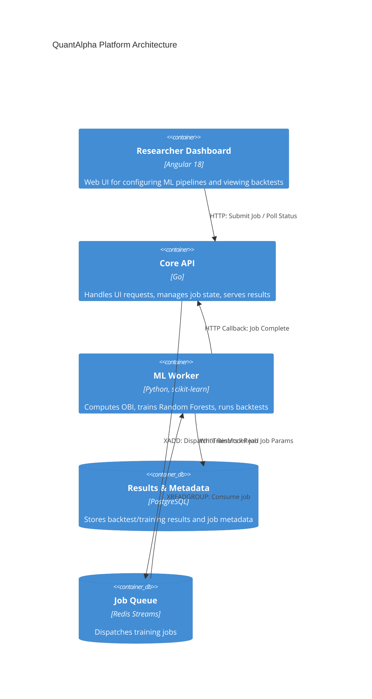

## Provenance & Source

- **Provenance** — Academic research platform, built in a university research context rather than at a
  trading firm. It is a research and ingestion pipeline: it computes signals and backtests them. It does
  not execute orders, and there is no matching engine.
- **Role** — Contributor: the Go ingestion API and the Python worker pipeline, plus the OBI/factor
  computation. The platform was not built alone.
- **Source** — [github.com/khoahotran/HFT](https://github.com/khoahotran/HFT)

## Project Foundation

**Business Problem:** High-Frequency Trading (HFT) researchers need to process massive amounts of Level-3 order book data to find alpha (predictive signals). Training machine learning models on this data is computationally expensive. A monolithic web app cannot simultaneously serve the UI, calculate Order Book Imbalances (OBI), and run Python-based machine learning classifiers without freezing.

**Goals:**
1. Decouple the frontend, the API backend, and the heavy machine-learning workers.
2. Ingest and process tick-level data from the VN30F2112 futures contract.
3. Allow researchers to run rolling-window ML training (e.g., train on 30 minutes, predict the next 10 seconds).
4. Provide real-time UI updates when long-running ML jobs complete.

## Implementation Status

QuantAlpha Lab is a working research platform — a real Go API, Angular frontend, and Python training worker — built alongside a few deliberately unbuilt "target design" pieces that the sections below and the linked deep-dive articles explain in context.

**Currently implemented:**
- Go API (Gin) and Angular 18 frontend, connected via Redis Streams
- Python worker training real `scikit-learn` models (Random Forest, Gradient Boosting, and others) on request
- Tick data read directly from CSV via `pandas`; PostgreSQL stores results, models, and job metadata — not tick data
- One-shot training and backtest jobs, triggered per request
- Startup-time PEL self-recovery for a crashed worker's own pending jobs
- A single-level OBI calculation, shipped as a seeded example user alpha script
- A compensating rollback and duplicate-submission guard on the backtest dispatch path, covered by an automated test

**Target design / research direction (not yet built):**
- A dedicated Go ingestion daemon bulk-loading tick data into PostgreSQL via `COPY`, indexed with BRIN
- Continuous rolling-window retraining on a roughly 10-second cadence, rather than one fit per request
- A richer, multi-consumer-group Redis Streams topology with `XAutoClaim`-based cross-worker recovery
- A weighted, multi-level depth-imbalance OBI feature computed automatically for every model

**Known reliability boundary:** the dual-write between PostgreSQL and Redis is not a general atomic transaction — a crash between the two writes (rather than a clean Redis-side error) can still leave an inconsistent record, and the training path doesn't yet have the same rollback the backtest path does.

The rest of this page — and the linked articles — explain *why* each target-design item is the direction this research platform was heading, not just that it isn't finished.

## Architecture

QuantAlpha relies on an asynchronous, event-driven architecture using **Redis Streams** as the backbone for job distribution between Go and Python.

### C4 Container Diagram

> **Current implementation vs. diagram:** the PostgreSQL container above stores backtest/training results and job metadata — it does not store tick data. Tick data is read directly from flat CSV files by the Python worker (see the Data Ingestion Pipeline note below), not queried out of Postgres.

## Engineering Decisions

### 1. Redis Streams vs RabbitMQ/BullMQ
**Decision:** We chose Redis Streams to bridge the Go API and the Python worker.
**Trade-offs:** 
- We needed a reliable queue that supported Consumer Groups (so we could easily scale up to 10 Python workers in parallel).
- RabbitMQ was too heavy to operate for this scale. BullMQ is excellent, but it requires Node.js/TypeScript. Since our API is Go and our worker is Python, Redis Streams provided the perfect language-agnostic, low-latency queue built directly into a data store we were already using for caching. See the [Redis Streams vs BullMQ benchmark](/experiments/redis-streams-vs-bullmq-job-queue-comparison) for the measured throughput/latency comparison behind this choice.

### 2. Rolling Window Machine Learning
**Decision:** Financial data is highly non-stationary (market regimes change rapidly). A static model trained on yesterday's data will fail today.
**Target design:** A rolling-window training approach — pull the last 30 minutes of tick data, train a Random Forest classifier, predict the direction of the next 10 seconds, then roll the window forward by 10 seconds and repeat continuously throughout the trading day.
**Current implementation:** the Python worker's `train` job runs this fit once per request. A user (or the API) submits a date-range-bounded training job over CSV-sourced tick data, the worker performs a single chronological 80/20 train/validation split and fit, and returns metrics. There is no scheduler or loop that automatically re-triggers training every 10 seconds — continuous rolling retraining is the target design described above, not what's currently running.

### 3. Order Book Imbalance (OBI) as a Feature
**Decision:** Rather than feeding raw prices into the ML model, we engineer specific market microstructure features.
**Current implementation:** the one OBI calculation shipped in the repository is a simple single-level version — `(bid_depth − ask_depth) / (bid_depth + ask_depth)` — provided as a seeded example user alpha script, not an automatic feature the training pipeline computes for every model. A high OBI suggests buying pressure. This engineered feature dramatically improved the model's F1 score compared to raw price feeds. **Research direction:** the [OBI research deep dive](/research/order-book-imbalance-hft-signal) explores a weighted, multi-level depth-imbalance version of this signal as a research methodology — not a calculation currently wired into the automatic training pipeline.

## Production Engineering

- **Job Recovery:** If a Python worker crashes mid-job, Redis Streams' Consumer Group feature keeps the job in the Pending Entries List (PEL) rather than losing it. **Current implementation:** the worker reclaims its own pending jobs from the PEL once, at its own startup — there is no separate watchdog process, and the consumer name is currently a fixed, hardcoded value rather than one assigned per worker instance, so this doesn't yet support reassigning an abandoned job to a *different*, healthy worker. A dedicated watchdog with per-worker consumer identities and cross-worker reclaim is the target design for true multi-worker resilience, not what's currently running.
- **Data Ingestion Pipeline (target design):** The intended pipeline is a separate Go daemon that parses CSVs and bulk-inserts into PostgreSQL using the `COPY` command — `COPY`'s batch-loading path is well-documented to avoid per-row `INSERT` overhead by an order of magnitude or more, so the specific "50x" figure is framed as an expected difference from that known behavior, not a benchmark run against this pipeline. **Current implementation:** no such daemon exists yet, and tick data is not stored in PostgreSQL at all — the Python worker reads the instrument's CSV file directly with `pandas.read_csv` and filters it in memory by date range for each job.

## Reflection

**Lessons Learned:**
- **Database Indexing for Time-Series (target design):** If tick data moves into PostgreSQL as data volume grows (see Data Ingestion Pipeline above), querying 30-minute windows across millions of rows will need a BRIN (Block Range Index) on the timestamp column rather than a default B-tree — BRIN suits naturally time-ordered data at a fraction of the storage cost. **Current implementation:** tick data isn't stored in PostgreSQL in the current repository (it's read directly from CSV), so no BRIN index exists yet — this is a planned optimization for the ingestion pipeline above, not a change made to a running system.
- **Python GIL Limitations:** Scaling the Python worker horizontally across multiple processes was necessary because Python's Global Interpreter Lock (GIL) prevented a single multi-threaded process from fully utilizing all CPU cores during heavy scikit-learn training.

**Future Evolution:**
If the dataset grows beyond a few hundred million rows, I plan to migrate the market data storage from PostgreSQL to TimescaleDB or ClickHouse to better handle specialized time-series aggregations.

<a href="/graph" class="inline-block mt-8 text-sm text-slate-500 hover:text-slate-700 hover:underline transition-colors">See how this project connects to the rest of the ecosystem &rarr;</a>
