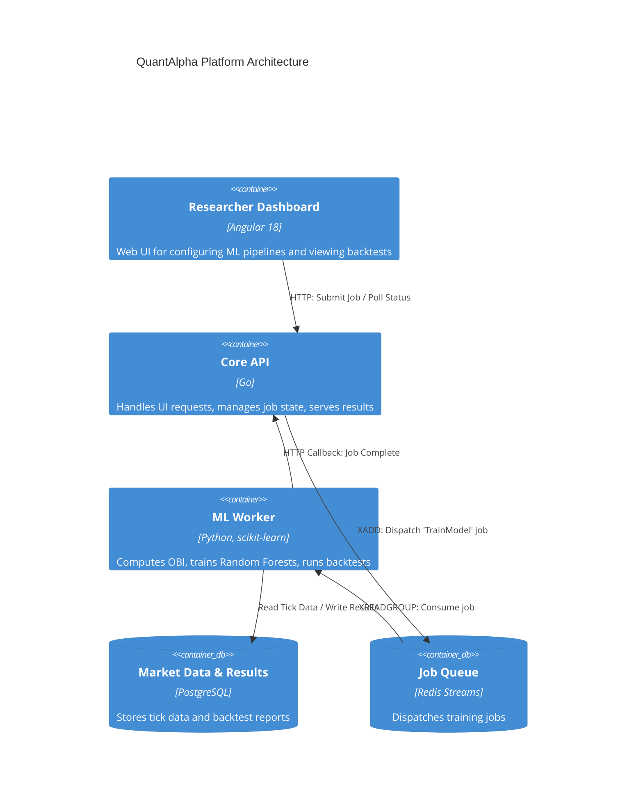

## Project Foundation

**Business Problem:** High-Frequency Trading (HFT) researchers need to process massive amounts of Level-3 order book data to find alpha (predictive signals). Training machine learning models on this data is computationally expensive. A monolithic web app cannot simultaneously serve the UI, calculate Order Book Imbalances (OBI), and run Python-based machine learning classifiers without freezing.

**Goals:**
1. Decouple the frontend, the API backend, and the heavy machine-learning workers.
2. Ingest and process tick-level data from the VN30F2112 futures contract.
3. Allow researchers to run rolling-window ML training (e.g., train on 30 minutes, predict the next 10 seconds).
4. Provide real-time UI updates when long-running ML jobs complete.

## Architecture

QuantAlpha relies on an asynchronous, event-driven architecture using **Redis Streams** as the backbone for job distribution between Go and Python.

### C4 Container Diagram

## Engineering Decisions

### 1. Redis Streams vs RabbitMQ/BullMQ
**Decision:** We chose Redis Streams to bridge the Go API and the Python worker.
**Trade-offs:** 
- We needed a reliable queue that supported Consumer Groups (so we could easily scale up to 10 Python workers in parallel).
- RabbitMQ was too heavy to operate for this scale. BullMQ is excellent, but it requires Node.js/TypeScript. Since our API is Go and our worker is Python, Redis Streams provided the perfect language-agnostic, low-latency queue built directly into a data store we were already using for caching.

### 2. Rolling Window Machine Learning
**Decision:** Financial data is highly non-stationary (market regimes change rapidly). A static model trained on yesterday's data will fail today.
**Implementation:** The Python worker implements a rolling-window training approach. It queries the PostgreSQL database for the last 30 minutes of tick data, trains a Random Forest classifier, and predicts the direction of the next 10 seconds. It then rolls the window forward by 10 seconds and repeats.

### 3. Order Book Imbalance (OBI) as a Feature
**Decision:** Rather than feeding raw prices into the ML model, we engineer specific market microstructure features.
**Implementation:** The worker calculates the Order Book Imbalance (the volume of limit buy orders vs limit sell orders at the top of the book). A high OBI suggests buying pressure. This engineered feature dramatically improved the model's F1 score compared to raw price feeds.

## Production Engineering

- **Job Idempotency:** If a Python worker crashes mid-training, Redis Streams' Consumer Group feature ensures the job remains in the Pending Entries List (PEL). A watchdog process claims abandoned jobs and assigns them to a healthy worker, ensuring no backtest is ever lost.
- **Data Ingestion Pipeline:** Tick data is ingested via a separate Go daemon that parses CSVs and bulk-inserts into PostgreSQL using the `COPY` command, achieving ingestion rates 50x faster than standard `INSERT` statements.

## Reflection

**Lessons Learned:**
- **Database Indexing for Time-Series:** Querying 30-minute windows across millions of rows of tick data was initially extremely slow. We had to heavily optimize PostgreSQL using BRIN (Block Range Indexes) on the timestamp columns, which reduced query times from seconds to milliseconds.
- **Python GIL Limitations:** Scaling the Python worker horizontally across multiple processes was necessary because Python's Global Interpreter Lock (GIL) prevented a single multi-threaded process from fully utilizing all CPU cores during heavy scikit-learn training.

**Future Evolution:**
If the dataset grows beyond a few hundred million rows, I plan to migrate the market data storage from PostgreSQL to TimescaleDB or ClickHouse to better handle specialized time-series aggregations.
