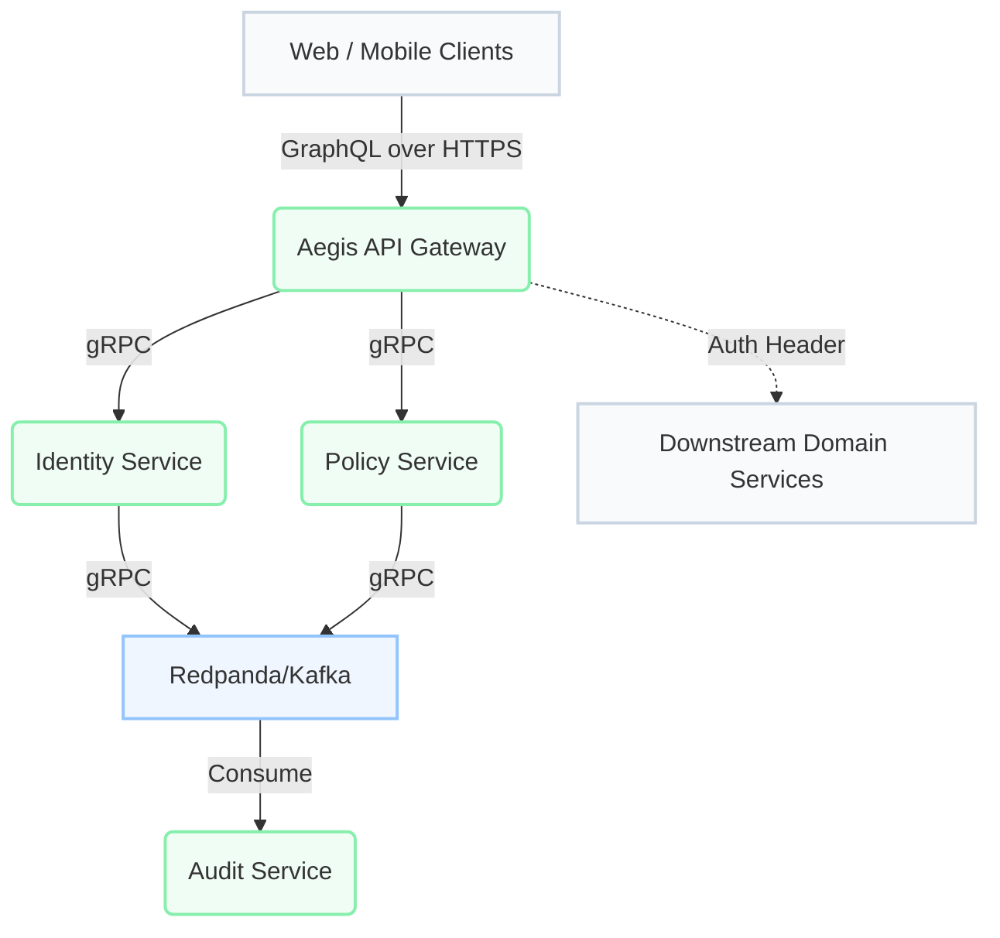
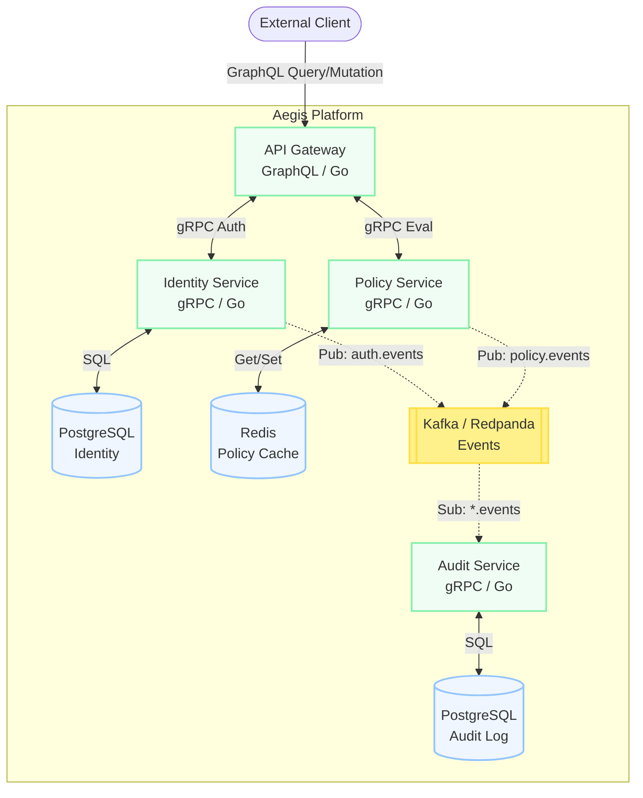
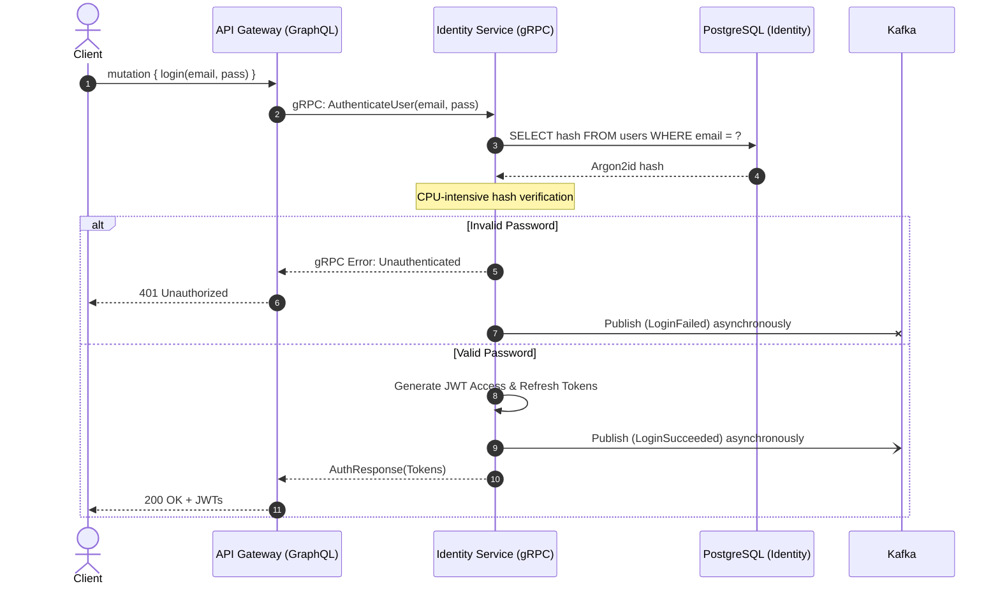
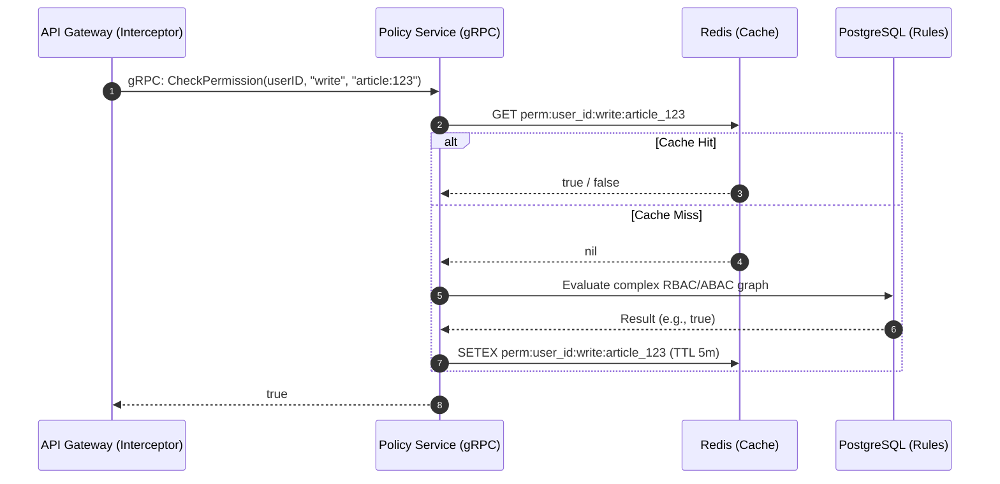

Authentication and authorization are often the first bottlenecks in a growing system. A monolithic auth service can quickly become a single point of failure and a scaling bottleneck, especially when policy evaluation happens on every single incoming request.

To address this, I built **Aegis**—a modular, high-performance auth platform designed around strict service boundaries, observability, and sub-millisecond policy decisions.

In this deep dive, I'll break down the system context, the internal container architecture, and the request flows for authentication and authorization.

## System Context (C4 Level 1)

Aegis acts as the front door for downstream domain services. It provides a unified GraphQL API to external clients while keeping internal communication strictly gRPC.

## Container Architecture (C4 Level 2)

Breaking the system down further, Aegis consists of four distinct Go microservices, each with its own datastore and responsibility.

### 1. API Gateway (GraphQL)
The entry point. It translates GraphQL mutations (like `login`, `register`) into gRPC calls to the Identity service, and runs a GraphQL middleware that intercepts queries to check permissions against the Policy service.

### 2. Identity Service (gRPC)
Handles user lifecycle, password hashing using `Argon2id`, and JWT issuance. It owns the PostgreSQL database containing user credentials. 

### 3. Policy Service (gRPC)
An ultra-fast decision engine. It evaluates RBAC/ABAC rules. Since this service is queried on *almost every API call*, it uses Redis as an aggressive caching layer for policy decisions.

### 4. Audit Service (gRPC)
A passive consumer. Both Identity and Policy services drop events onto a Kafka topic asynchronously. The Audit service consumes these and persists them to its own PostgreSQL database for compliance reporting.

---

## Core Flows

Let's look at how the services interact during two critical paths: Login and Policy Evaluation.

### The Login Sequence

The login flow must verify credentials, issue a token, and reliably record the audit event without blocking the client.

**Key Design Decisions:**
- **Asynchronous Audit:** The `Publish` to Kafka happens concurrently or in a detached goroutine. We do not want Kafka latency to impact the user's login time.
- **CPU Offloading:** `Argon2id` is deliberately slow. Scaling the Identity service horizontally handles the CPU pressure of concurrent logins.

### The Policy Evaluation Sequence

Policy checks are the highest-throughput operation in the platform. A cache miss here is expensive, so Redis is utilized aggressively.

**Key Design Decisions:**
- **Fail-Closed Default:** If Redis is down and PostgreSQL is overloaded, the Policy service defaults to `false` (Deny) to prevent accidental escalation.
- **Cache Invalidation:** When a user's roles change, the Identity service emits an event to Kafka. A separate worker consumes this and evicts the relevant Redis keys.

## Observability & OpenTelemetry

With four services and a message broker, distributed tracing is mandatory. Without it, debugging a failed login is a guessing game.

Aegis integrates OpenTelemetry (OTel) natively. The API gateway generates the root span and injects the trace ID into the gRPC metadata context.

Every subsequent gRPC hop extracts that context, adds child spans, and forwards it. The result is a unified trace in Jaeger that shows exactly how many milliseconds were spent in the Gateway, Identity Service, Argon2id hashing, and Kafka publishing.

## Next Steps

Aegis solves the structural problems of auth, but introduces new distributed systems challenges:
1. **Cache Invalidation:** Keeping the Policy Redis cache in sync with the source of truth.
2. **Kafka Delivery Guarantees:** Ensuring audit logs are never dropped if Kafka temporarily goes down (requiring the Transactional Outbox pattern).

For more on how the API surface was designed, read the ADR on [Why GraphQL Gateway over REST](/research/adr-graphql-gateway-over-rest).
