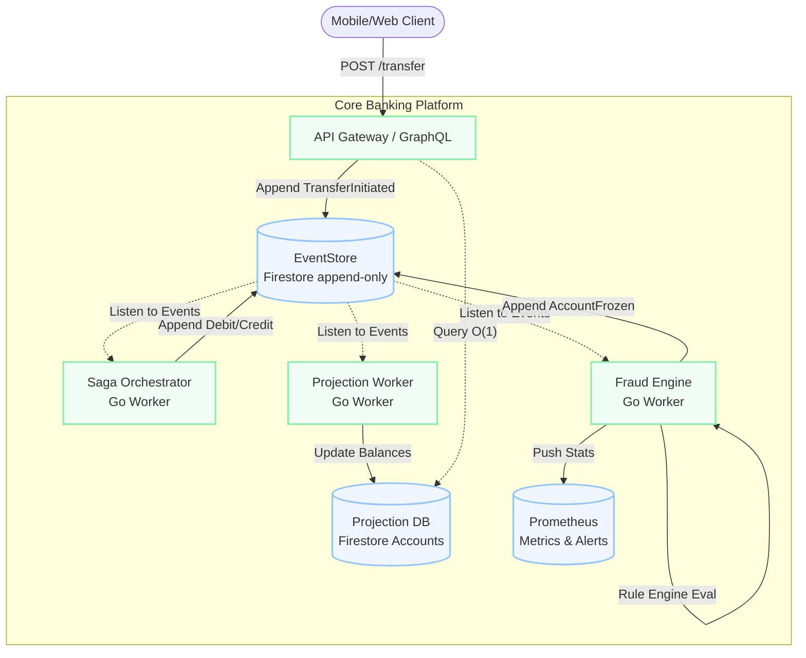
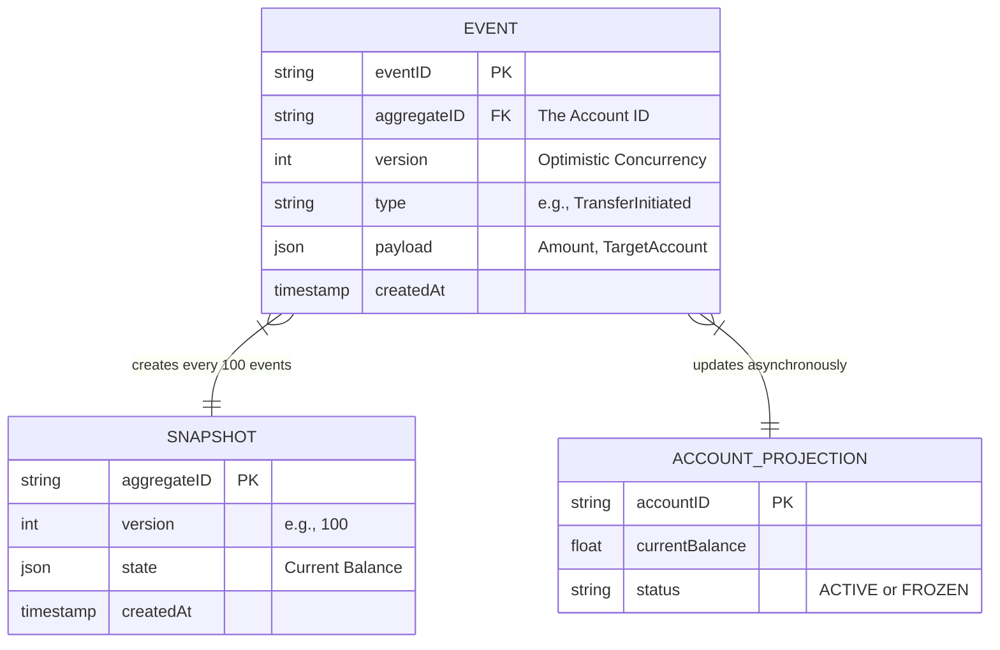
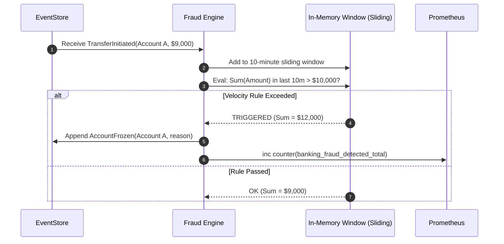

In a core banking system, detecting fraud *after* the money has left the platform is too late. Fraud detection must be inline, real-time, and deeply integrated into the transaction lifecycle.

When building my Event-Driven Core Banking project in Go, I designed a Fraud Engine that evaluates every transfer against a set of dynamic velocity and behavioral rules. If a rule triggers, the account is immediately frozen via a Saga compensation, preventing further fund movement.

## System Context (C4 Level 2)

The Core Banking platform is built on an Event Sourcing and CQRS architecture using Firestore as the underlying datastore. 

## The EventStore Data Model

Because the system uses Event Sourcing, the `EventStore` is the single source of truth. Accounts and balances do not exist as mutable rows; they are derived from an append-only log of events.

## Fraud Detection: Velocity Rules

Fraudsters rarely make one large, obvious transaction. They test stolen credentials with a small ping (e.g., $1.00), wait for silence, and then execute a burst of high-velocity transfers just under the AML reporting threshold.

To catch this, the Fraud Engine implements **Velocity Rules** and **Burst-Silence Detection**.

### The Rule Evaluation Flow

The Fraud Engine is a passive listener on the EventStore. It tails the Firestore `events` collection for any `TransferInitiated` event.

### Snapshotting for Performance

Because the Fraud Engine needs to evaluate historical context (e.g., "how many transfers happened today"), reading the entire event log for an active account would be O(N) and far too slow.

To solve this, the system creates a `Snapshot` every 100 events. 
When the Fraud Engine needs historical context, it reads the latest snapshot + any events that occurred *after* that snapshot. This bounds the read to O(1) relative to total event count; "under 15ms" is an expected range for that access pattern rather than a measured figure — no load test, environment, or sample size is claimed here.

## Handling the Saga Compensation

In the target orchestrator design described in the [Saga pattern deep dive](/system-design/implementing-the-saga-pattern-for-distributed-transfers), if the Fraud Engine detects anomaly and appends an `AccountFrozen` event, the Saga Orchestrator (which is executing the multi-step transfer) would see this state change, halt the transfer, execute compensation transactions (refunding any debits already applied), and mark the Saga as `COMPENSATED_FRAUD`.

> **Current implementation vs. this design:** the currently committed Core Banking repository does not implement this centralized orchestrator or the `COMPENSATED_FRAUD` state. Its Saga logic is the choreography-style `SagaManager` described in the linked Saga pattern deep dive, which reacts to domain events — including `AccountFrozen` — directly, rather than through a persisted state machine. The fraud-triggered compensation flow above is the target design this project was working toward, not a description of what's currently running.

## Conclusion

By treating fraud detection as an asynchronous projection rather than a synchronous API blocker, the Core Banking API remains incredibly fast for legitimate users, while the Fraud Engine independently monitors and clamps down on malicious activity in near real-time.
