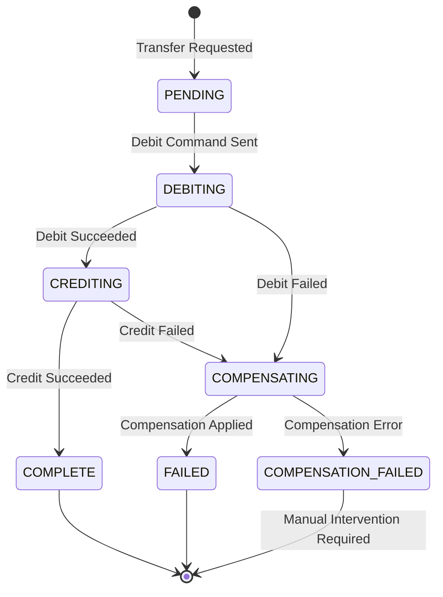

## The Double-Write Problem

In a traditional SQL database, transferring money between two accounts is trivial: wrap a `BEGIN TRANSACTION`, debit one row, credit another, and `COMMIT`. Atomicity is guaranteed by the database engine.

In an event-sourced system built on a document store like Firestore, this guarantee disappears. Each account is an independent aggregate with its own event stream. There is no concept of a cross-aggregate transaction. If we debit Account A and then the process crashes before crediting Account B, we have lost money.

This is the core problem the **Saga pattern** solves.

---

## What Is a Saga?

A Saga is a sequence of local transactions, each of which updates a single aggregate and publishes an event or message. If any step fails, the Saga executes **compensating transactions** to undo the effects of all previous steps.

There are two implementation styles:

```
CHOREOGRAPHY (Event-Driven, Decentralized)
AccountA ──► publishes DebitedEvent
                 └──► AccountB hears it, credits itself
                           └──► publishes TransferCompletedEvent

ORCHESTRATOR (Command-Driven, Centralized)
SagaOrchestrator ──► commands Debit(AccountA)
                 ◄── receives DebitSucceeded
                 ──► commands Credit(AccountB)
                 ◄── receives CreditSucceeded
                 ──► marks Saga COMPLETE
```

We chose the **Orchestrator style** for our Core Banking system for one reason: **observability**. With choreography, reconstructing what went wrong in a failed transfer requires correlating events across multiple aggregates. With an orchestrator, the entire state machine lives in one place.

---

## The Saga State Machine

Each transfer goes through a well-defined lifecycle. The orchestrator is responsible for driving the state forward and initiating compensations on failure:



> **Key insight:** `COMPENSATION_FAILED` is a terminal state that requires human intervention. A Saga that cannot compensate must be surfaced immediately — it represents real financial inconsistency.

---

## Technical Implementation

Here is the full Go implementation from our Event-Driven Core Banking project.

### 1. The Saga Document (Firestore State Machine)

Each Saga instance is persisted as a Firestore document. This gives us durable state that survives process restarts:

```go
package saga

import "time"

// TransferStatus represents the lifecycle state of a money transfer saga.
type TransferStatus string

const (
    StatusPending            TransferStatus = "PENDING"
    StatusDebiting           TransferStatus = "DEBITING"
    StatusCrediting          TransferStatus = "CREDITING"
    StatusComplete           TransferStatus = "COMPLETE"
    StatusCompensating       TransferStatus = "COMPENSATING"
    StatusFailed             TransferStatus = "FAILED"
    StatusCompensationFailed TransferStatus = "COMPENSATION_FAILED"
)

// TransferSaga represents the durable state of a cross-aggregate transfer.
type TransferSaga struct {
    ID              string         `firestore:"id"`
    SourceAccountID string         `firestore:"sourceAccountId"`
    TargetAccountID string         `firestore:"targetAccountId"`
    Amount          int64          `firestore:"amount"` // In minor units (e.g., cents)
    Status          TransferStatus `firestore:"status"`
    FailureReason   string         `firestore:"failureReason,omitempty"`
    DebitEventID    string         `firestore:"debitEventId,omitempty"`
    CreditEventID   string         `firestore:"creditEventId,omitempty"`
    CreatedAt       time.Time      `firestore:"createdAt"`
    UpdatedAt       time.Time      `firestore:"updatedAt"`
    RetryCount      int            `firestore:"retryCount"`
}
```

### 2. The Saga Orchestrator

The orchestrator coordinates each step. It reads the current saga state, executes the next command, and transitions state — all within Firestore transactions to prevent double-execution:

```go
package saga

import (
    "context"
    "fmt"
    "time"

    "cloud.google.com/go/firestore"
    "go.uber.org/zap"
)

const maxRetries = 3

type Orchestrator struct {
    db      *firestore.Client
    account AccountCommander // Port interface for account aggregate
    logger  *zap.Logger
}

// Execute drives the saga forward from its current state.
// It is safe to call multiple times — it is fully idempotent.
func (o *Orchestrator) Execute(ctx context.Context, sagaID string) error {
    sagaRef := o.db.Collection("transfer_sagas").Doc(sagaID)

    return o.db.RunTransaction(ctx, func(ctx context.Context, tx *firestore.Transaction) error {
        snap, err := tx.Get(sagaRef)
        if err != nil {
            return fmt.Errorf("fetching saga %s: %w", sagaID, err)
        }

        var saga TransferSaga
        if err := snap.DataTo(&saga); err != nil {
            return fmt.Errorf("decoding saga: %w", err)
        }

        switch saga.Status {
        case StatusPending:
            return o.stepDebit(ctx, tx, sagaRef, &saga)
        case StatusDebiting:
            // Orchestrator was restarted mid-step; re-check outcome
            return o.checkDebitOutcome(ctx, tx, sagaRef, &saga)
        case StatusCrediting:
            return o.checkCreditOutcome(ctx, tx, sagaRef, &saga)
        case StatusComplete, StatusFailed, StatusCompensationFailed:
            return nil // Terminal states — no action required
        default:
            return fmt.Errorf("unknown saga status: %s", saga.Status)
        }
    })
}

func (o *Orchestrator) stepDebit(
    ctx context.Context,
    tx *firestore.Transaction,
    ref *firestore.DocumentRef,
    saga *TransferSaga,
) error {
    o.logger.Info("saga: initiating debit",
        zap.String("sagaId", saga.ID),
        zap.String("accountId", saga.SourceAccountID),
        zap.Int64("amount", saga.Amount),
    )

    eventID, err := o.account.Debit(ctx, saga.SourceAccountID, saga.Amount, saga.ID)
    if err != nil {
        // Move to compensating immediately on hard failure
        return tx.Update(ref, []firestore.Update{
            {Path: "status", Value: StatusCompensating},
            {Path: "failureReason", Value: err.Error()},
            {Path: "updatedAt", Value: time.Now()},
        })
    }

    return tx.Update(ref, []firestore.Update{
        {Path: "status", Value: StatusDebiting},
        {Path: "debitEventId", Value: eventID},
        {Path: "updatedAt", Value: time.Now()},
    })
}
```

### 3. Compensation: Reversing a Debit

When the credit step fails after a successful debit, we must reverse the debit. This is the compensation transaction — it is also idempotent, guarded by the `debitEventId`:

```go
func (o *Orchestrator) compensate(
    ctx context.Context,
    tx *firestore.Transaction,
    ref *firestore.DocumentRef,
    saga *TransferSaga,
) error {
    o.logger.Warn("saga: initiating compensation",
        zap.String("sagaId", saga.ID),
        zap.String("sourceAccount", saga.SourceAccountID),
    )

    // Reverse the debit by crediting the source account back.
    // We pass the original debitEventId as the compensationRef so the
    // account aggregate can verify this is a reversal, not a duplicate credit.
    err := o.account.Credit(ctx, saga.SourceAccountID, saga.Amount, "REVERSAL:"+saga.DebitEventID)
    if err != nil {
        o.logger.Error("saga: COMPENSATION FAILED — manual intervention required",
            zap.String("sagaId", saga.ID),
            zap.Error(err),
        )
        return tx.Update(ref, []firestore.Update{
            {Path: "status", Value: StatusCompensationFailed},
            {Path: "failureReason", Value: fmt.Sprintf("compensation error: %s", err.Error())},
            {Path: "updatedAt", Value: time.Now()},
        })
    }

    return tx.Update(ref, []firestore.Update{
        {Path: "status", Value: StatusFailed},
        {Path: "updatedAt", Value: time.Now()},
    })
}
```

### 4. The Saga Worker (Polling Loop)

The orchestrator is driven by a lightweight background worker that polls for in-progress sagas and re-drives them. This handles crash recovery automatically:

```go
package worker

import (
    "context"
    "time"

    "cloud.google.com/go/firestore"
    "go.uber.org/zap"
)

// SagaWorker polls Firestore for non-terminal sagas and drives them forward.
// This design means the system self-heals after any crash — sagas simply
// resume from their last durable state on the next poll cycle.
type SagaWorker struct {
    db           *firestore.Client
    orchestrator *saga.Orchestrator
    logger       *zap.Logger
    pollInterval time.Duration
}

func (w *SagaWorker) Run(ctx context.Context) {
    ticker := time.NewTicker(w.pollInterval)
    defer ticker.Stop()

    for {
        select {
        case <-ctx.Done():
            w.logger.Info("saga worker shutting down")
            return
        case <-ticker.C:
            w.processActiveSagas(ctx)
        }
    }
}

func (w *SagaWorker) processActiveSagas(ctx context.Context) {
    // Query all sagas that are not in a terminal state
    iter := w.db.Collection("transfer_sagas").
        Where("status", "in", []string{"PENDING", "DEBITING", "CREDITING", "COMPENSATING"}).
        Documents(ctx)

    for {
        doc, err := iter.Next()
        if err != nil {
            break
        }

        var s saga.TransferSaga
        if err := doc.DataTo(&s); err != nil {
            w.logger.Error("failed to decode saga", zap.Error(err))
            continue
        }

        if err := w.orchestrator.Execute(ctx, s.ID); err != nil {
            w.logger.Error("saga execution error",
                zap.String("sagaId", s.ID),
                zap.Error(err),
            )
        }
    }
}
```

---

## Failure Mode Analysis

| Failure Point | Saga State at Crash | Recovery Action | Data Safety |
|:---|:---|:---|:---|
| **Process crash before debit** | `PENDING` | Worker re-drives from `PENDING` → retries debit | ✅ No money moved |
| **Process crash during debit** | `DEBITING` | Worker polls debit event store to check outcome | ✅ Idempotent debit via saga ID |
| **Debit succeeds, credit fails** | `CREDITING` → `COMPENSATING` | Orchestrator issues reversal credit to source | ✅ Balance restored |
| **Compensation also fails** | `COMPENSATION_FAILED` | Alert fires; DBA manually inspects ledger | ⚠️ Manual intervention |
| **Duplicate saga submission** | `COMPLETE` (already) | Orchestrator returns early — no re-execution | ✅ Idempotency key guards |

---

## Orchestrator vs. Choreography: The Real Trade-off

| Dimension | Choreography | Orchestrator |
|:---|:---|:---|
| **Observability** | Requires correlating events across multiple streams | Single saga document holds complete history |
| **Coupling** | Services are coupled to each other's events | Services are coupled only to the orchestrator |
| **Debugging** | Hard — you must reconstruct saga from distributed logs | Easy — one Firestore document, one state |
| **Adding a step** | Requires updating multiple event consumers | Requires updating orchestrator only |
| **Failure isolation** | A consumer bug silently skips steps | Orchestrator explicitly gates each transition |

For financial systems where **auditability and debuggability** are non-negotiable, the orchestrator model pays for its added coupling with dramatic operational clarity.

---

## Key Takeaways

1. **Sagas make cross-aggregate consistency explicit.** Rather than pretending atomicity exists, they model the failure modes directly in the state machine — making compensation a first-class citizen.
2. **The worker polling loop is your crash-recovery mechanism.** Any saga in a non-terminal state is automatically resumed on the next poll cycle, regardless of why the process exited.
3. **`COMPENSATION_FAILED` must alert immediately.** This is not a recoverable state. It means real money is in an inconsistent position and requires a human to inspect the ledger.
4. **Idempotency is the bedrock.** Every command sent by the orchestrator must carry a deterministic idempotency key (the `sagaId` or a derived token) so retries are safe.
