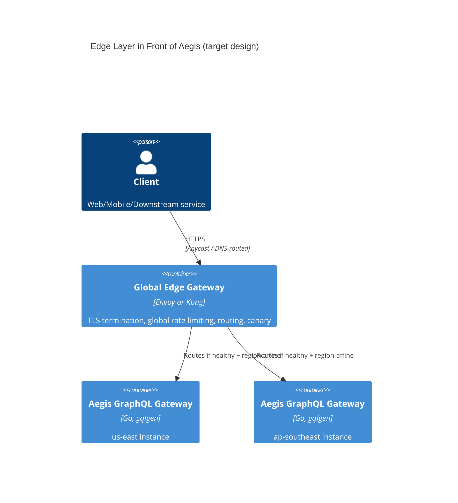

## Two Different Jobs Wearing the Same Name

[Aegis's ADR on GraphQL over REST](/research/adr-graphql-gateway-over-rest) settled a real question:
what shape should the API surface be, for one running instance of the gateway service. That's an
**application-layer** decision — it lives in `gqlgen`, resolvers, and the internal gRPC fan-out.

"API Gateway" also names a completely different, **network-layer** job: given N instances of that
GraphQL service running across however many regions, how does a request from anywhere in the world
find a healthy one, get TLS terminated, get rate-limited *before* it ever reaches application code,
and get routed to the right version during a deploy? Aegis's own code has no opinion on any of
that, and shouldn't — conflating the two is how a service ends up reimplementing mTLS handling
inside its own resolver layer.

This article is about the second job: the edge layer a real multi-instance, multi-region Aegis
deployment would need in front of the gateway the ADR already designed. **None of this is built or
deployed** — Aegis runs in Docker Compose today, a single instance, no edge layer at all. This is
the architecture that job would require, and why.

## What the Edge Layer Actually Has to Do

Four jobs, each independent of the others, each wrong to bolt onto the application service itself:

1. **TLS termination and mTLS to origin.** Every instance re-implementing certificate rotation is
   both duplicated effort and a duplicated attack surface; terminating once at the edge and using
   short-lived internal mTLS certs to the origin is the standard shape for exactly this reason.
2. **Health-aware routing.** A GraphQL instance stuck resolving a slow downstream gRPC call should
   stop receiving new traffic before it falls over, not after — this requires the edge layer to
   actively health-check origins, which is infrastructure, not application logic.
3. **Global rate limiting.** A *per-instance* limiter (like the [Token Bucket implementation in the
   Rate Limiting lab](/experiments/rate-limiting-algorithms)) only sees the traffic that particular
   instance receives. A client hitting 5 different regional instances at 80% of the per-instance
   limit each is nowhere near any single instance's threshold, yet is 4x over the intended global
   limit — the edge layer is the only place with the full picture, which means it needs either a
   shared state store (Redis-backed counters) or approximate distributed counting, not just N
   independent copies of the same algorithm.
4. **Canary and blue-green routing.** Shifting 5% of traffic to a new gateway version, by header or
   weighted routing, so a bad deploy affects a bounded fraction of requests instead of all of them
   — again a routing-layer concern, orthogonal to what the GraphQL resolvers do.

## Envoy vs Kong: What the Choice Actually Trades Off

Both are legitimate answers; they optimize for different things.

**Envoy** is a proxy first — xDS-configured, extend via WASM or native filters, the substrate
Istio/Ambient service meshes are built on. Choosing Envoy is choosing to configure infrastructure
as data (xDS) and to be comfortable operating a service mesh's worth of moving parts. It's the
right choice when the edge gateway needs to compose with an internal mesh doing the same kind of
routing between Aegis's own services, not just at the edge.

**Kong** is a gateway first — a plugin architecture (rate limiting, auth, transformation) on top of
Nginx/OpenResty, with a control-plane API and admin UI as first-class citizens rather than something
built separately. Choosing Kong is choosing operational convenience for gateway-specific concerns
(the four jobs above, largely as configurable plugins) over the lower-level composability Envoy
offers. For a team whose actual need stops at "route, limit, terminate TLS, canary" rather than "run
a full service mesh," Kong reaches that outcome with less to operate.

**For Aegis's target design specifically:** Kong is the better fit. Aegis has no internal service
mesh today (services call each other's gRPC endpoints directly), so Envoy's mesh-composability
buys nothing yet — it would be infrastructure adopted for capability not currently needed. Kong's
plugin model maps directly onto the four jobs above without requiring xDS configuration or a mesh
control plane to already exist.

## Why This Is Sequenced After the Application-Layer Decision, Not Before

It would be backwards to design the edge layer before the GraphQL ADR: the edge gateway's job is to
route to *something* — until the application-layer shape was decided, there was nothing concrete to
route to, health-check, or rate-limit in front of. This is also why the rate-limiting question shows
up twice in this portfolio at two different layers doing two different jobs: the
[algorithms lab](/experiments/rate-limiting-algorithms) is correct and complete as a per-instance
building block; a global gateway is what would compose several of those (or a shared counter store)
into an actual cross-instance limit. Neither replaces the other.

## What Would Have to Be True First

This is explicitly a target design, not a roadmap with a date: it presumes multiple Aegis instances
across regions exist, which they don't. The honest trigger for building this is "Aegis has a second
real deployment target," not "Kong looks interesting" — the same measure-before-acting discipline
`.ai/phases/phase-5.md` §5.7 already applies to search-index scale.
